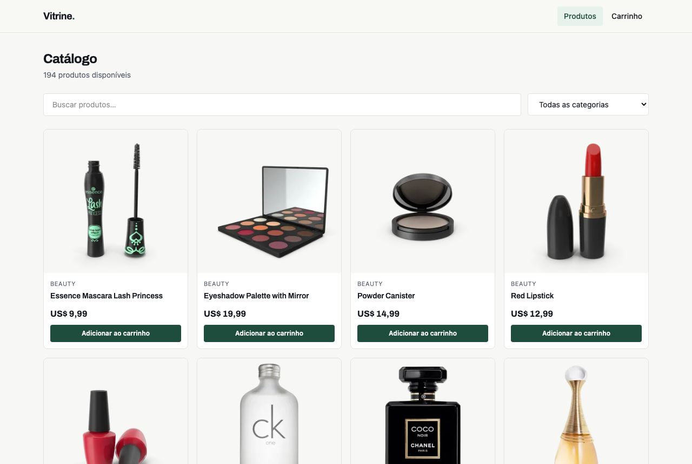

# Vitrine

Catálogo de produtos com busca, filtro por categoria, paginação, página de detalhe e carrinho persistente. Construído em **React + TypeScript**, consumindo uma **API REST**.

O objetivo do projeto não foi mostrar quantas bibliotecas eu sei instalar, e sim tratar bem as quatro situações que toda tela que busca dados na internet enfrenta: **carregando, erro, vazio e sucesso**.

## Demonstração

**🔗 Ver no ar: [guilhermeoliveira337.github.io/vitrine-react](https://guilhermeoliveira337.github.io/vitrine-react/)**

Rodando localmente:

```bash
npm install
npm run dev
```

Abre em `http://localhost:5173`.



## Stack

| Ferramenta | Por que está aqui |
|---|---|
| React 19 + TypeScript | Tipagem nas respostas da API evita erro em tempo de execução quando o formato muda |
| Vite | Build e dev server rápidos, sem configuração |
| TanStack Query | Cache, revalidação e os estados de requisição sem `useEffect` manual |
| React Router | Rotas de catálogo, detalhe e carrinho |
| Axios | Cliente HTTP com `baseURL` e timeout centralizados |
| Tailwind CSS | Estilo junto do componente, sem arquivo de CSS órfão |

Dados: [DummyJSON](https://dummyjson.com) — API pública, sem chave.

## O que o projeto faz

- **Busca com debounce de 400 ms.** Sem isso, cada tecla digitada vira uma requisição.
- **Filtro por categoria**, desabilitado durante a busca porque a API não combina os dois.
- **Paginação** que mantém a lista anterior na tela enquanto carrega a próxima, em vez de piscar.
- **Página de detalhe** por rota (`/produto/:id`).
- **Carrinho** com Context API, quantidade por item e persistência em `localStorage`.
- **Responsivo mobile first**, de 2 a 4 colunas.
- Foco visível em todos os controles e `prefers-reduced-motion` respeitado.

## Os quatro estados

Ficam juntos em [`src/components/Estados.tsx`](src/components/Estados.tsx), de propósito: se cada tela implementasse o seu, uma delas ia esquecer algum.

- **Carregando** — esqueleto com o mesmo formato dos cartões, para o layout não saltar quando os dados chegam.
- **Erro** — explica o que aconteceu e oferece **Tentar novamente**, que chama o `refetch` da query.
- **Vazio** — repete o termo buscado, para o usuário entender *por que* não veio nada.
- **Sucesso** — a lista, com opacidade reduzida durante uma revalidação em segundo plano.

## Decisões que vale explicar

**A escolha de endpoint mora na camada de API, não no componente.**
A API tem rotas diferentes para listagem, busca e categoria. Essa decisão está em [`src/api/produtos.ts`](src/api/produtos.ts). O componente só diz *o que* quer; não sabe *de onde* vem.

**Trocar filtro reseta a página.**
Sem isso, quem está na página 5 e busca outra coisa cai numa página que não existe no novo recorte, e vê uma lista vazia que parece bug.

**`localStorage` corrompido não derruba a aplicação.**
A leitura do carrinho está em `try/catch` e devolve lista vazia em caso de falha. Um JSON inválido salvo por uma versão anterior não pode quebrar a tela inteira.

**O carrinho agrupa por produto.**
Adicionar o mesmo item duas vezes incrementa a quantidade, em vez de criar duas linhas iguais.

## Estrutura

```
src/
├── api/          # cliente HTTP e chamadas — onde a API é conhecida
├── components/   # componentes de UI reaproveitados
├── context/      # estado global do carrinho
├── hooks/        # useDebounce e as queries
├── pages/        # uma por rota
├── types/        # contratos da API
└── utils/        # formatação
```

## Publicação

Publicado no GitHub Pages por GitHub Actions a cada push na `main` ([workflow](.github/workflows/deploy.yml)).

Como o Pages serve arquivos estáticos e não conhece as rotas do React Router, o build copia o `index.html` para `404.html`. O Pages devolve esse arquivo em qualquer caminho desconhecido, o React Router lê a URL e renderiza a tela certa. O efeito colateral conhecido é que rotas profundas chegam com status HTTP 404, mesmo renderizando corretamente — limitação de SPA em hospedagem estática.

## O que eu faria a seguir

- Testes com Vitest e Testing Library, começando pelos estados de erro e vazio.
- Filtro de faixa de preço, que exige combinar parâmetros que a API não expõe hoje.
- Checkout com validação de formulário.

---

Construído por [Guilherme Oliveira](https://www.linkedin.com/in/guilherme-oliveira-frontend) — [Olyver Studio](https://olyverwebstudio.com.br)
